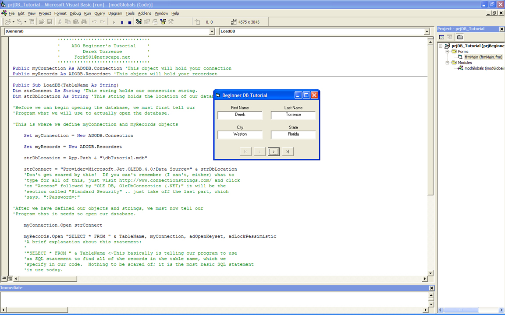



## Beginner ADO Database Tutorial

### Description

This is just a very basic beginner's tutorial for using ADO to connect to a database. Trust me, there are more comments than code!

Please leave comments, as they help me grow! I won't beg for votes, but they also help me grow. I'd like to create more database tutorials, but need to know how to improve for future versions.
 
### More Info
 
This only retrieves data, since it is a beginner's guide. More of a foot-in-the-door to help out anyone who knows nothing about connecting to databases.

             |
---                |---
**Submitted On**   |2006-09-05 13:59:02
**By**             |[DTorrence](https://github.com/Planet-Source-Code/PSCIndex/blob/master/ByAuthor/dtorrence.md)
**Level**          |Beginner
**User Rating**    |5.0 (10 globes from 2 users)
**Compatibility**  |VB 6\.0
**Category**       |[Databases/ Data Access/ DAO/ ADO](https://github.com/Planet-Source-Code/PSCIndex/blob/master/ByCategory/databases-data-access-dao-ado__1-6.md)
**World**          |[Visual Basic](https://github.com/Planet-Source-Code/PSCIndex/blob/master/ByWorld/visual-basic.md)
**Archive File**   |[Beginner\_A201811952006\.zip](https://github.com/Planet-Source-Code/dtorrence-beginner-ado-database-tutorial__1-66473/archive/master.zip)

